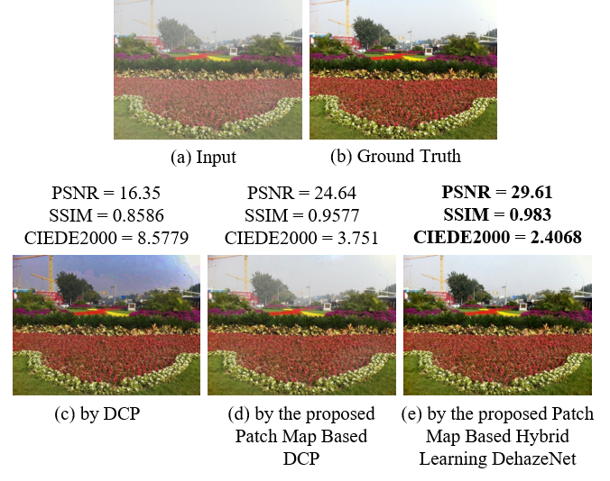

# PMHLD: Patch Map Based Hybrid Learning DehazeNet for Single Image Haze Removal (Accepted by IEEE Transaction on Image Processing 2020)

**Wei-Ting Chen, Hao-Yu Feng, Jian-Jiun Ding, Sy-Yen Kuo**

Paper:
https://ieeexplore.ieee.org/document/9094006



You can also refer our related works on dehazing:

<br>
1."PMS-Net: Robust Haze Removal Based on Patch Map for Single Images" which has been published in **CVPR 2019**.

Paper:
http://openaccess.thecvf.com/content_CVPR_2019/html/Chen_PMS-Net_Robust_Haze_Removal_Based_on_Patch_Map_for_Single_CVPR_2019_paper.html

Github:
https://github.com/weitingchen83/PMS-Net

and

2."JSTASR: Joint Size and Transparency-AwareSnow Removal Algorithm Based on ModifiedPartial Convolution and Veiling Effect Removal" which has been published in **ECCV 2020**.

Paper: 

Github: https://github.com/weitingchen83/JSTASR-DesnowNet-ECCV-2020

# Abstract:

Images captured in a hazy environment usually suffer from bad visibility and missing information. Over many years, learning-based and handcrafted prior-based dehazing algorithms have been rigorously developed. However, both algorithms exhibit some weaknesses in terms of haze removal performance. Therefore, in this work, we have proposed the patch-map-based hybrid learning DehazeNet, which integrates these two strategies by using a hybrid learning technique involving the patch map and a bi-attentive generative adversarial network. In this method, the reasons limiting the performance of the dark channel prior (DCP) have been analyzed. A new feature called the patch map has been defined for selecting the patch size adaptively. Using this map, the limitations of the DCP (e.g., color distortion and failure to recover images involving white scenes) can be addressed efficiently. In addition, to further enhance the performance of the method for haze removal, a patch-map-based DCP has been embedded into the network, and this module has been trained with the atmospheric light generator, patch map selection module, and refined module simultaneously. A combination of traditional and learning-based methods can efficiently improve the haze removal performance of the network. Experimental results show that the proposed method can achieve better reconstruction results compared to other state-of-the-art haze removal algorithms.


# Setup and environment

To generate the recovered result you need:

1. Python 3 
2. CPU or NVIDIA GPU + CUDA CuDNN (CUDA 9.0)
3. tensorflow 1.6.0
4. keras 2.2.0
5. cv2 3.4.4

Testing

```
$ python ./predict.py -dataroot ./your_dataroot -datatype datatype -predictpath ./output_path -batch_size batchsize
```

*datatype default: tif, jpg ,png

Example:

```
$ python ./predict.py -dataroot ./testImg -predictpath ./p -batch_size 3
$ python ./predict.py -dataroot ./testImg -datatype tif -predictpath ./p -batch_size 3
```

Please download the pretrained models and put them in the "modelParam" folder.
The pretrained model can be downloaded from: https://drive.google.com/drive/folders/1WCn4ioNS4mw3dT45t8dU6xyH23ZlzSAf?usp=sharing


# Citations
Please cite this paper in your publications if it helps your research.  

Bibtex:
```
@article{chen2020pmhld,
  title={PMHLD: Patch Map Based Hybrid Learning DehazeNet for Single Image Haze Removal},
  author={Chen, Wei-Ting and Fang, Hao-Yu and Ding, Jian-Jiun and Kuo, Sy-Yen},
  journal={IEEE Transactions on Image Processing},
  year={2020},
  publisher={IEEE}
}

```
